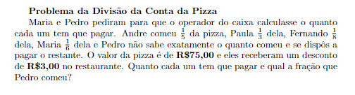
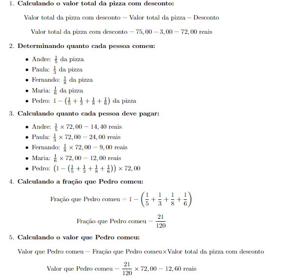

# FORTRAN-66-O-problema-da-Pizza
Repositório criado para complementar o estudo da matemática básica, exemplificando questões de provas lógicas em fortran, para reforçar o estudo da matemática.

# Ambiente

 - Sistema Operacional: Linux - ArchLinux
 - Compilador: GCC Fortran
 - Linguagem: FORTRAN versão F66 

 # Funcionamento

   Compilando a aplicação

   ```bash
   gfortran -o app app.f90

   ./app

   ``` 

   # Observação

     Caso você receba um erro ao tentar comitar na man , sobre o certificado , execute o comando abaixo

     ```bash 
     git config --global http.sslVerify false
     
     ```

# Forma mais simples 

Se você estiver no seu desktop, EE abrir este repositório no seu navegador, você pode ir até o canto da branch main , clicar em codespace, ja deixei um codespace preparado para você.


# Enunciado



# Solução Matemática



# Meu Desafio

  Criar um sistema que ajude o operador de caixa a calcular o quanto cada pessoa tem que pagar por sua parcela na pizza, na conta do restaurante , seguindo o problema matemático da questão numero 2 do dia 15 de estudos da Matemática básica, aula de Frações e Equações.

# O fluxo simplicifado


# Considerações Finais

o porquê do uso da linguagem fortran você deva estar se perguntando, é simplesmente porque como eu estou estudando para, fazer concurso, para o enem e também para o vestibular da universidade Univesp , para o curso da engenharia da computação, já estou me preparando unindo o útil ao agradável, que seria como eu estou aprendendo a matemática revisando muita coisa com aprendi anos atrás, estou resolvendo todos esses exercícios no caderno.

Porém eu percebi que muitos dos enunciados eles são lógicos, eles têm uma cadeia lógica de enunciação do problema, pensar nessa lógica nesse enunciado do problema me ajuda a refletir isso como um sistema, o que torna mais fácil para mim aplicar a matemática e aplicar as técnicas que eu aprendo para poder chegar no resultado e provar o resultado matemático.

E a linguagem fortran ela assim como matlab, ela é muito boa para isso porque ela tem baixíssima abstração, na verdade quase nenhuma, é uma linguagem totalmente feita para processos e cálculos matemáticos e científicos.

Se você chegou até aqui, parabéns, você foi o único que conseguiu me entender Uauauauaua.


